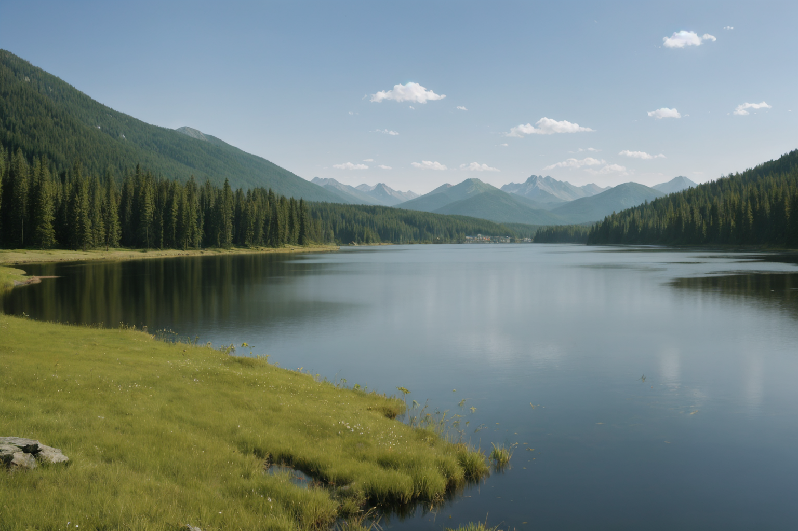
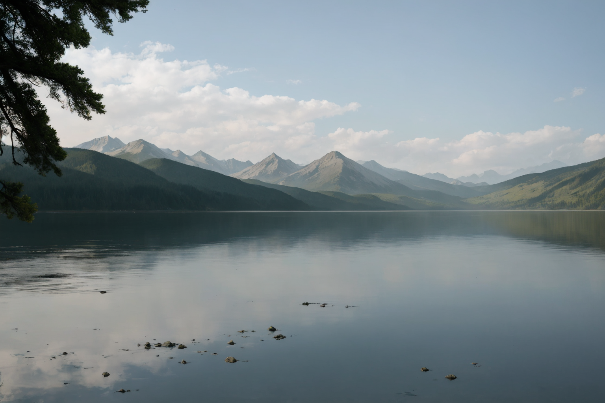
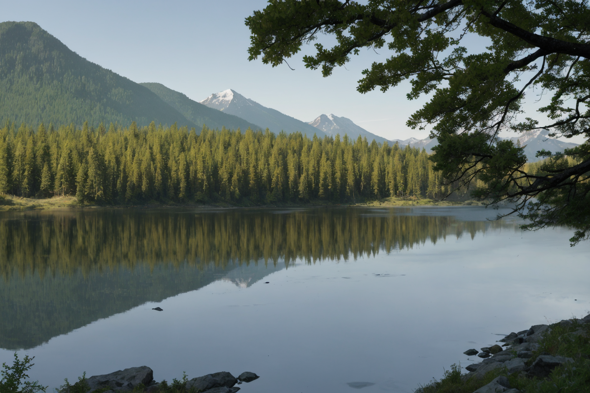
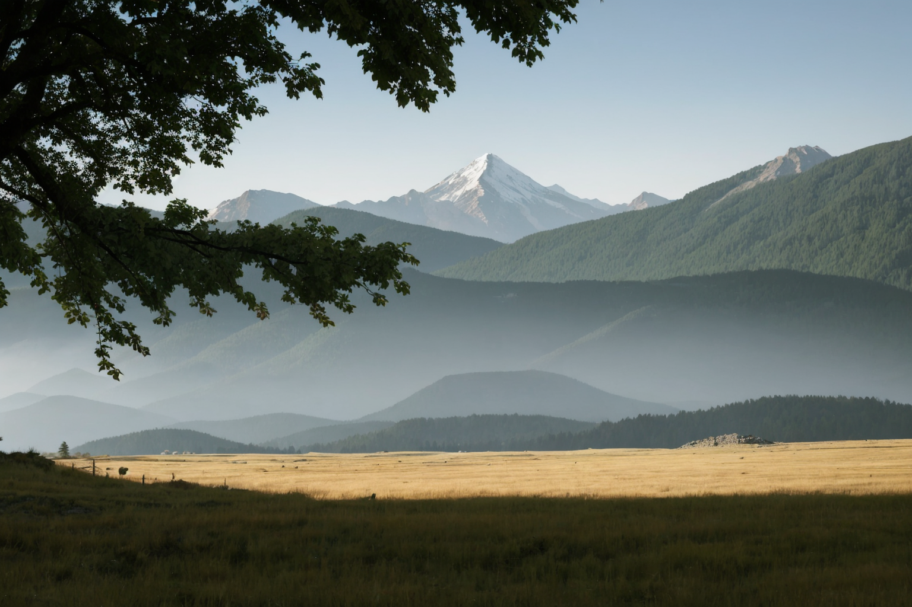

# **02_Or Functionality**

This document demonstrates the **OR functionality** used with the prompt `mountain|lake|forest`. The OR logic introduces variation by randomly selecting one of the options specified in the prompt. Below are the generated results along with a comparative analysis.

---

## **Generated Images**

| **Image** 			 		  | **Resolved Prompt**  | **Description** 																												  		| **Comments** 																																		|
|---------------------------------|----------------------|--------------------------------------------------------------------------------------------------------------------------------------|---------------------------------------------------------------------------------------------------------------------------------------------------|
|  | `lake` 				 | A peaceful lake surrounded by forested mountains. 																			  		| The serene lake reflects the surrounding trees and mountains, showcasing the "lake" option. 														|
|  | `lake` 				 | A tranquil lake with a broader mountain range in the background. 																  	| Similar to Image 1 but with a more expansive view and slightly different composition. 															|
|  | `forest` 			 | A tranquil forest scene reflected in a lake, with surrounding mountains in the background. 									 		| A more dominant forest presence with the lake in the foreground. This demonstrates the selection of "forest" as the prompt's resolved element.  	|
|  | `mountain` 			 | A landscape with a golden meadow in the foreground, a towering mountain in the background, framed by overhanging tree branches. 		| The resolved "mountain" prompt creates a majestic composition with a strong foreground element. 													|

---

## **Comparison**

| **Aspect**        	| **Image 1** 			| **Image 2** 				| **Image 3** 			 | **Image 4** 					  |
|-----------------------|-----------------------|---------------------------|------------------------|--------------------------------|
| **Primary Focus**  	| Lake        			| Lake       				| Forest      			 | Mountain   					  |
| **Foreground**     	| Grass and water 		| Trees and water 			| Trees and lake 		 | Golden meadow 				  |
| **Background**     	| Mountains   			| Mountains   				| Mountains  			 | Mountain    					  |
| **Color Palette**  	| Cool greens and blues | Cool greens and blues 	| Green and earthy tones | Warm earthy tones 			  |
| **Framing Elements**  | Open lake view 		| Open lake view 			| Forest reflection 	 | Framed by overhanging branches |

---

## **Observations**
1. The **OR functionality** successfully introduced randomness, creating varied landscapes while keeping the theme consistent.
2. The random selection allowed for a range of compositions:
   - **Image 1 & 2**: Focused on "lake" with different perspectives and foreground elements.
   - **Image 3**: Shifted to "forest," integrating trees and reflections.
   - **Image 4**: Highlighted "mountain," emphasizing a central peak with complementary framing.

3. The settings used were consistent across all images, demonstrating how the OR logic works independently of other parameters.

---

## **Conclusions**
- The OR functionality is a powerful tool for generating diverse outputs within the constraints of a prompt.  
- It encourages exploration and experimentation, especially when paired with variations in seed values or other prompt elements.

This document serves as a foundational example of how OR logic can be leveraged for creative image generation. 
