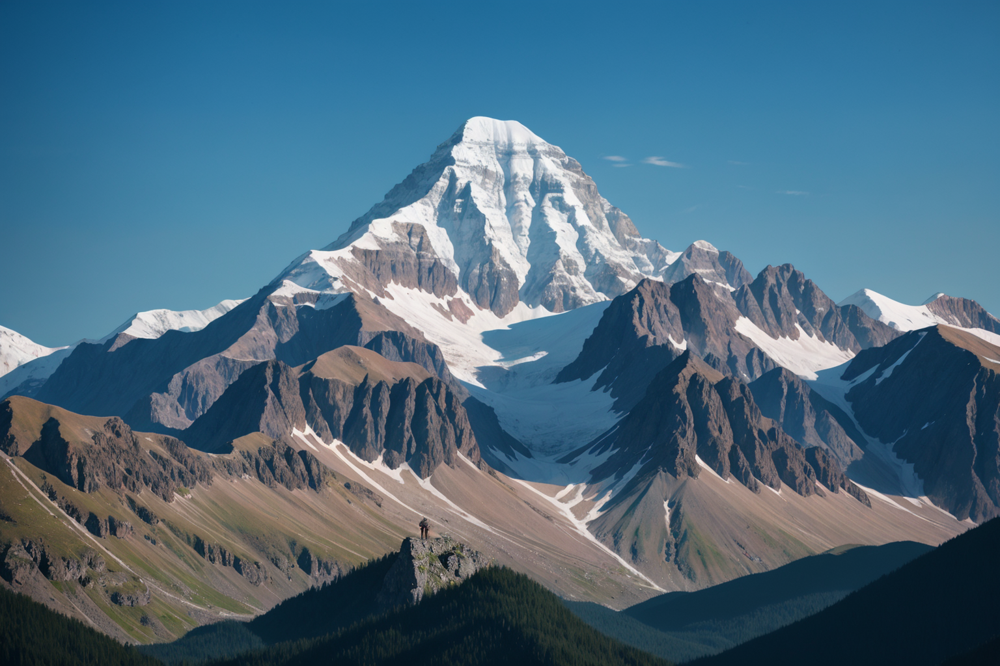
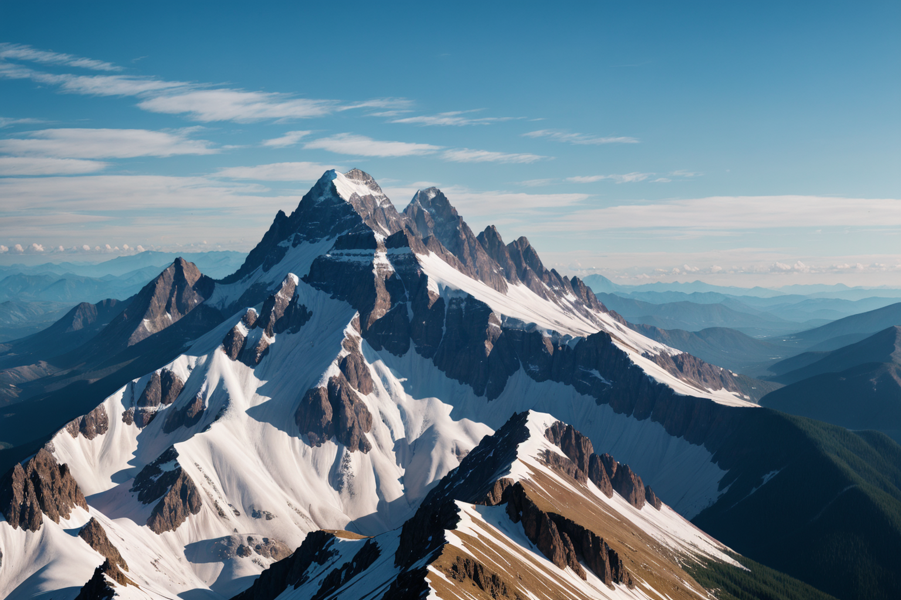
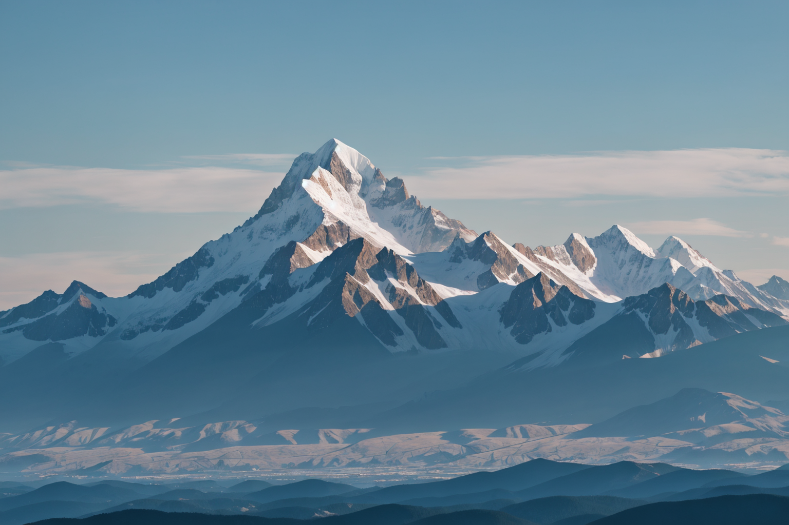
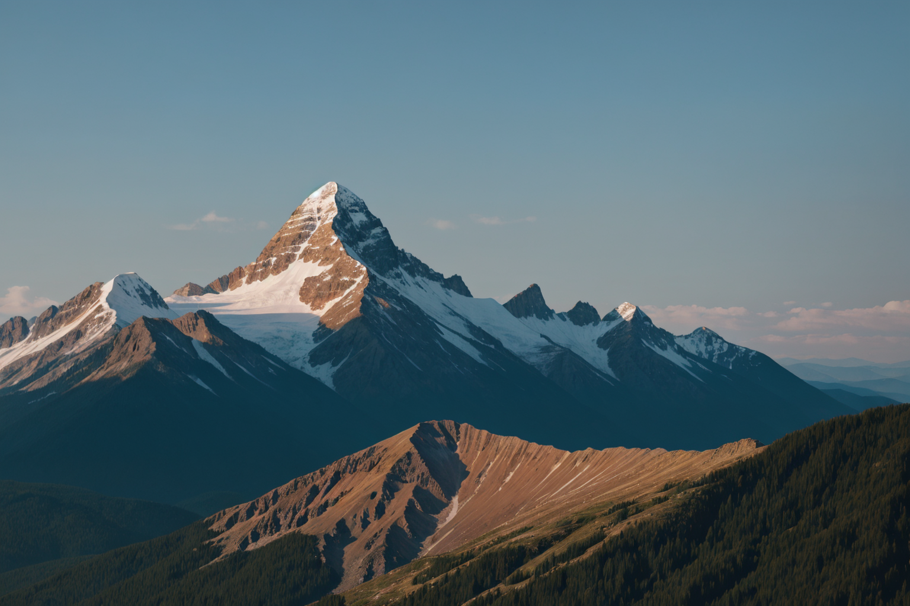

# **Example 2: Grouped Prompts Analysis**

## **Generated Images for Subset 1**

| **Image** 							| **Resolved Prompt** 	| **Description** 																			| **Comments** 																				|
|---------------------------------------|-----------------------|-------------------------------------------------------------------------------------------|-------------------------------------------------------------------------------------------|
|  	| `mountain` 			| A stunning snow-capped mountain with rugged peaks under a clear blue sky. 				| The resolved prompt emphasizes a singular dominant mountain with a balanced composition. 	|
|  	| `mountain` 			| Multiple sharp peaks covered in snow, creating a striking and dramatic mountain range. 	| Highlights the grandeur of mountain ranges with sharp, well-defined details. 				|
|  	| `mountain` 			| A single towering mountain with foothills and a distant valley under a soft sky. 			| The focus remains on the central mountain, with additional environmental context. 		|
|  	| `mountain` 			| A golden-lit mountain at sunset with layered hills and forested slopes. 					| Captures the transition of light, adding depth and atmosphere to the mountain. 			|

---

## **Comparison of Results**

| **Aspect**        	 | **Image 1**        	| **Image 2**        | **Image 3**         		| **Image 4**      		|
|------------------------|----------------------|--------------------|--------------------------|-----------------------|
| **Primary Focus**  	 | Single mountain   	| Multiple peaks     | Single mountain     		| Single mountain    	|
| **Foreground**     	 | Rugged terrain   	| Snow-covered peaks | Valleys and hills  		| Golden-lit hills   	|
| **Background**     	 | Clear blue sky    	| Distant peaks      | Valley and plains  	 	| Sunset hues        	|
| **Lighting**       	 | Neutral and bright	| Sharp and bright   | Soft and diffused   		| Warm and golden    	|
| **Color Palette** 	 | Cool blues        	| Cool whites/blues  | Cool blues and greens 	| Warm gold and greens 	|

---

## **Observations**

1. **Prompt Resolution**:
   - The prompt consistently resolved to "mountain" in all four images. This demonstrates that the grouped prompt `{mountain|lake|forest}` chose "mountain" as the dominant element for this subset.

2. **Compositional Variations**:
   - Despite resolving to the same prompt element, the images showcase diverse perspectives and lighting conditions.
   - The inclusion of environmental context (e.g., valleys, sunset lighting) adds unique characteristics to each image.

3. **Lighting and Atmosphere**:
   - The lighting transitions from bright and neutral (Image 1) to warm and atmospheric (Image 4), showcasing the flexibility in environmental representation.

4. **Focus on Mountains**:
   - The dominant feature in all images remains the mountains, varying from singular peaks to dramatic ranges.

---

## **Conclusion**

The grouped prompt `{mountain|lake|forest}` successfully generated diverse outputs within the same theme. This subset highlights the flexibility and creative potential of grouped prompts, even when resolving to a single element.

The next subsets will further explore variations with reordered groupings and nested prompts.
