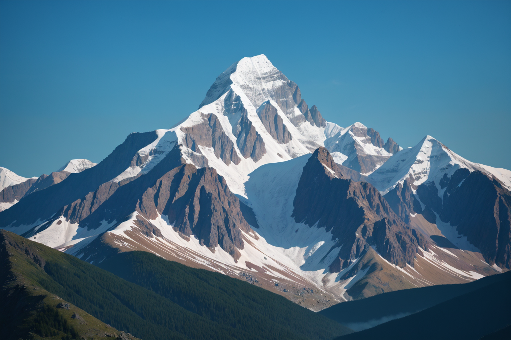
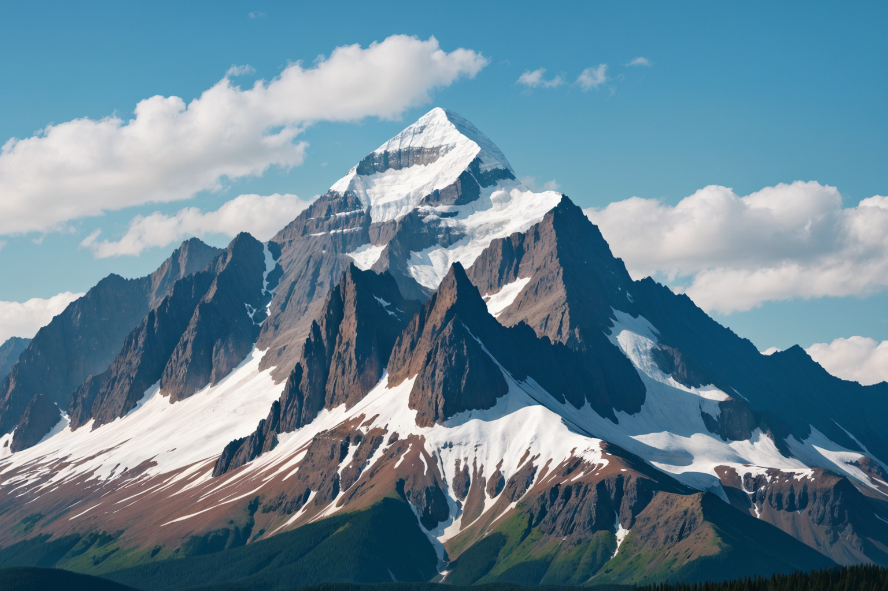
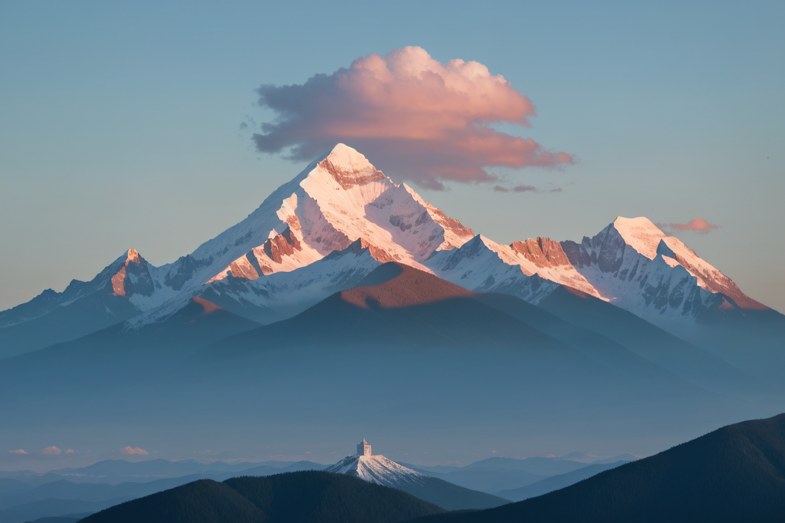
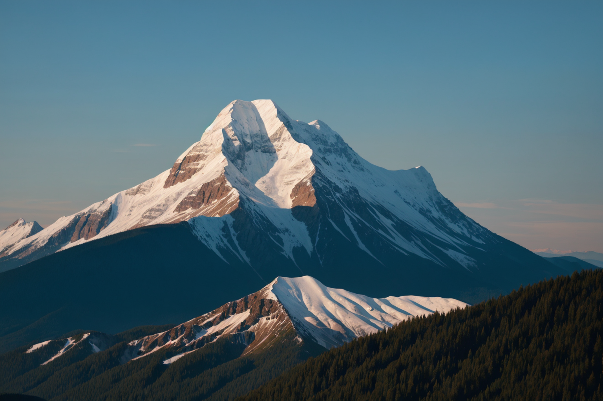

# **Example 2: Grouped Prompts Analysis - Subset 2**

This document demonstrates the use of the grouped prompt `{forest|lake|mountain}` in generating diverse outputs. Below are the generated images and their corresponding metadata, followed by a detailed comparative analysis.

---

## **Generated Images for Subset 2**

| **Image** 							| **Resolved Prompt** 	| **Description** 																			| **Comments** 																					|
|---------------------------------------|-----------------------|-------------------------------------------------------------------------------------------|-----------------------------------------------------------------------------------------------|
|   | `mountain` 			| A dramatic snow-capped mountain under a clear blue sky with rugged, sharp peaks. 			| The resolved prompt emphasizes a dominant mountain with crisp details and strong composition. |
|   | `mountain` 			| A towering mountain with dynamic shadows and snow-covered ridges under scattered clouds. 	| Highlights atmospheric elements and rugged mountain structures. 								|
|   | `mountain` 			| A serene mountain bathed in warm sunlight, with a unique pink cloud hovering above. 		| Captures an atmospheric and picturesque scene with dramatic lighting and soft colors. 		|
|   | `mountain` 			| A golden-lit mountain with cascading hills in the foreground under a warm evening sky. 	| Depicts a tranquil scene, emphasizing light transitions and depth. 							|

---

## **Comparison of Results**

| **Aspect**        	 | **Image 1**        | **Image 2**        | **Image 3**         | **Image 4**          |
|------------------------|--------------------|--------------------|---------------------|----------------------|
| **Primary Focus**  	 | Single mountain    | Single mountain    | Single mountain     | Single mountain      |
| **Foreground**    	 | Rugged terrain     | Snow ridges        | Layered hills       | Cascading hills      |
| **Background**    	 | Clear blue sky     | Cloudy sky         | Pink cloud          | Warm evening hues    |	
| **Lighting**      	 | Bright and crisp   | Diffused sunlight  | Warm, soft sunlight | Golden evening light |
| **Color Palette** 	 | Cool whites/blues  | Cool whites/blues  | Warm pinks/blues    | Warm golds/blues     |

---

## **Observations**

1. **Prompt Resolution**:
   - All images resolved to "mountain," demonstrating that despite the reordering of the grouped prompt, the output consistently selected "mountain" for this subset.

2. **Compositional Variations**:
   - Each image showcases unique compositions and lighting conditions, from sharp and dramatic peaks to tranquil, golden-lit landscapes.

3. **Atmospheric Effects**:
   - The subset features diverse atmospheres, including clear skies, diffused clouds, and warm sunlight.

4. **Focus on Mountains**:
   - Similar to Subset 1, the mountain remains the dominant feature, but the variations in lighting and perspective provide a refreshing diversity.

---

## **Conclusion**

The grouped prompt `{forest|lake|mountain}` successfully generated diverse outputs, with the dominant "mountain" theme consistently selected. This subset highlights the flexibility and creative potential of grouped prompts, emphasizing the importance of atmospheric and lighting variations in image composition.

The next subset will explore further prompt groupings for comparative analysis.
