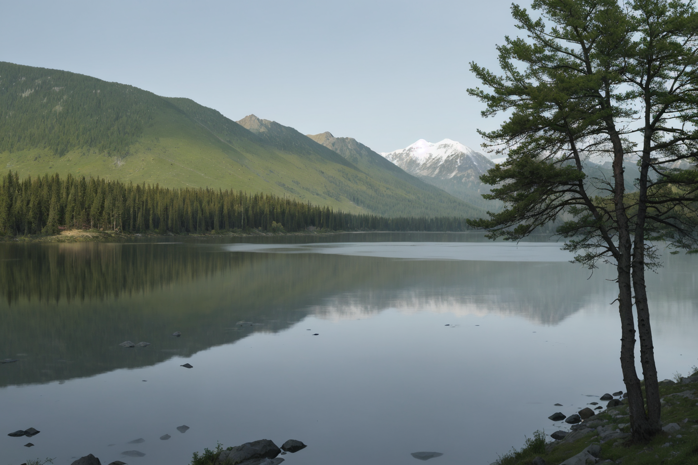

# **Example 2: Grouped Prompts Analysis - Subset 3**

This document demonstrates the use of the grouped prompt `{lake |mountain |forest}` in generating diverse outputs. Below are the generated images and their corresponding metadata, followed by a detailed comparative analysis.

---

## **Generated Images for Subset 3**

| **Image** 						   | **Resolved Prompt**  | **Description** 																						| **Comments** 																	 |
|--------------------------------------|----------------------|---------------------------------------------------------------------------------------------------------|--------------------------------------------------------------------------------|
|  | `lake` 			  | A tranquil lake surrounded by lush greenery and distant mountains under a clear sky. 					| The resolved prompt emphasizes the lake with a serene, reflective composition. |
|  | `lake` 			  | A wide, calm lake with faint ripples, bordered by forested slopes and distant peaks. 					| Captures a peaceful atmosphere with soft lighting and depth. 					 |
|  | `lake` 			  | A lake framed by a tree in the foreground, with snow-capped mountains visible in the background. 		| Adds a dynamic composition with natural framing and contrasting elements. 	 |
|  | `lake` 			  | A grassy field leading to a lake, with misty mountains in the background and a tree framing the view. 	| Combines a serene atmosphere with foreground interest and soft lighting. 		 |

---

## **Comparison of Results**

| **Aspect**         | **Image 1**        | **Image 2**        | **Image 3**         | **Image 4**        |
|--------------------|--------------------|--------------------|---------------------|--------------------|
| **Primary Focus**  | Lake               | Lake               | Lake                | Lake               |
| **Foreground**     | Grass and water    | Ripples and forest | Tree and lake       | Grass field        |
| **Background**     | Distant mountains  | Forested peaks     | Snowy mountains     | Misty mountains    |
| **Lighting**       | Bright and soft    | Soft and neutral   | Balanced light      | Diffused and soft  |
| **Color Palette**  | Greens and blues   | Greens and grays   | Greens and whites   | Greens and golds   |

---

## **Observations**

1. **Prompt Resolution**:
   - All images resolved to "lake," highlighting the grouped prompt's flexibility in selecting varied lake-based scenes.

2. **Compositional Variations**:
   - Each image offers unique perspectives, from wide-angle views to natural framing with trees and grassy fields.

3. **Atmospheric Effects**:
   - The subset captures serene and peaceful atmospheres, with diverse lighting and environmental details.

4. **Focus on Lakes**:
   - The lake remains the central feature, but the inclusion of foreground elements like trees and grassy fields adds depth and character.

---

## **Conclusion**

The grouped prompt `{lake |mountain |forest}` successfully generated diverse outputs, with "lake" consistently selected as the resolved prompt. This subset demonstrates the grouped prompt's potential for creating varied compositions, emphasizing serene and tranquil landscapes.

The next example will explore further prompt groupings for comparative analysis.
