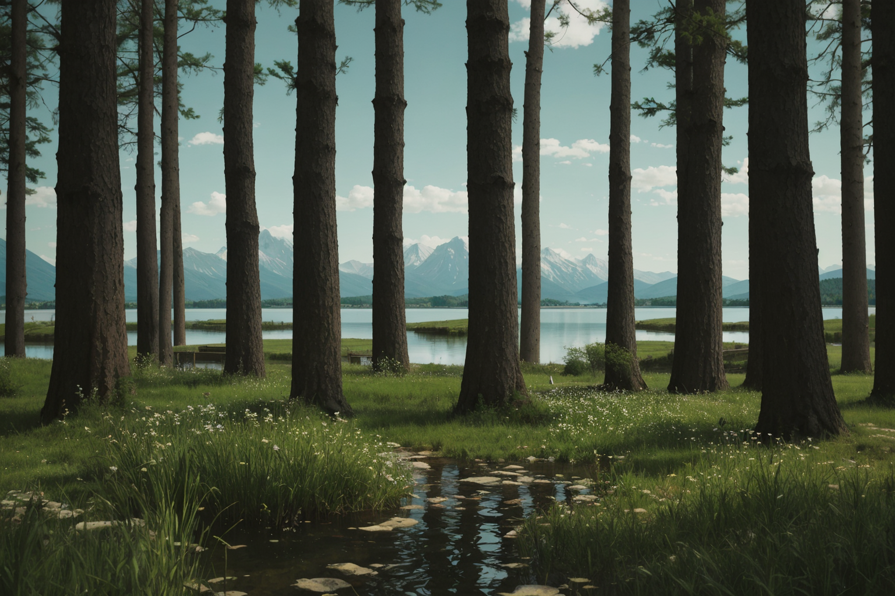
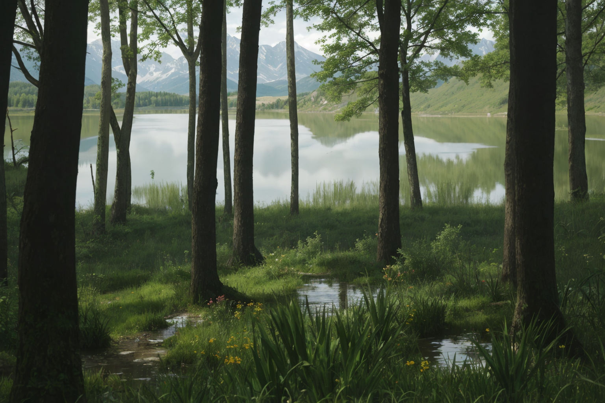
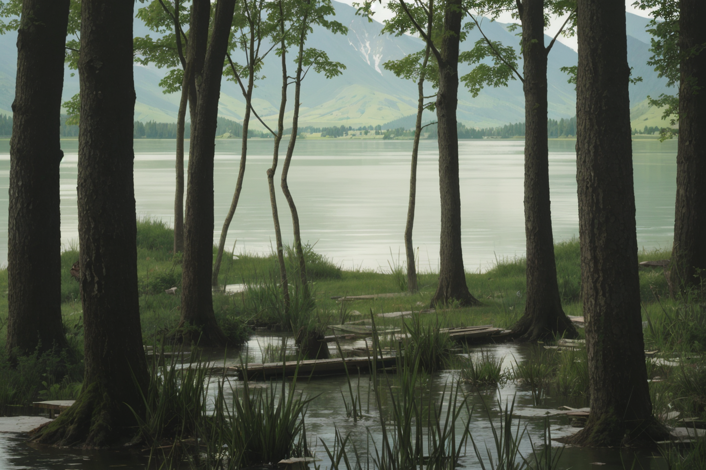
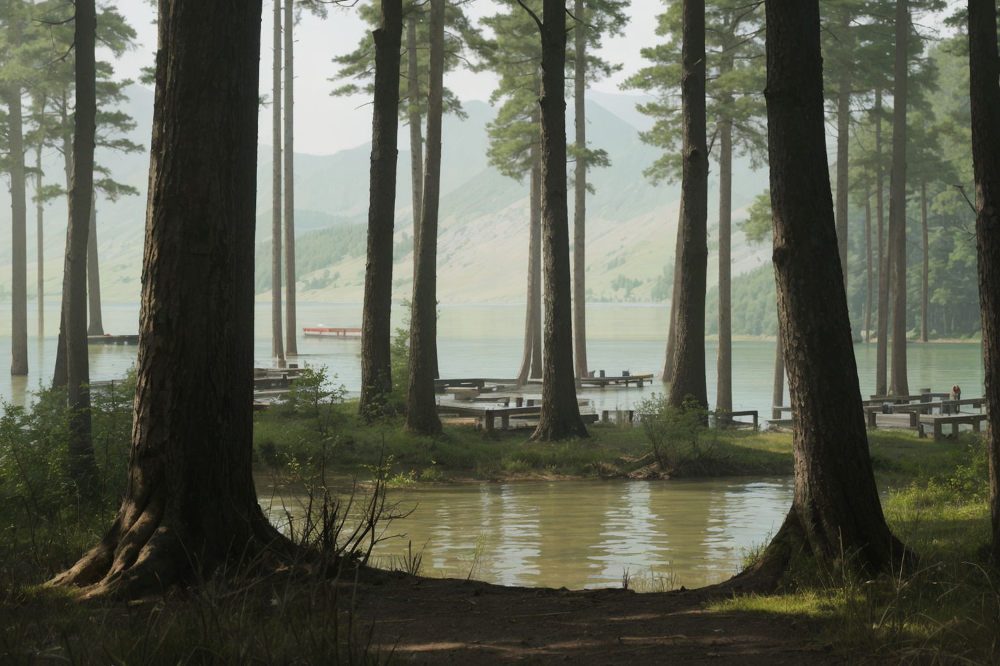

# **03_Grouped OR Functionality**

This document demonstrates the **Grouped OR functionality** used with the prompt `{lake, {mountain | forest}}`. This logic allows for nested options, where the primary focus is "lake" combined with a random choice between "mountain" or "forest." Below are the generated results along with a comparative analysis.

---

## **Generated Images**

| **Image** 			 	      | **Resolved Prompt**  		    | **Description** 																												  		| **Comments** 																																			|
|---------------------------------|---------------------------------|---------------------------------------------------------------------------------------------------------------------------------------|-------------------------------------------------------------------------------------------------------------------------------------------------------|
|  | `lake + forest`   			    | A serene lake framed by tall trees in the foreground, with distant mountains in the background. 										| The forest dominates the composition, with the lake creating a central focal point. This emphasizes the "forest" selection. 							|
|  | `lake + forest`   			    | A calm forest reflecting on the still lake, with trees creating a framing effect for the scenery. 								  	| The forest is highlighted by its reflection, while the lake serves as a serene element in the composition. 											|
|  | `lake + forest`   			    | A wooded area leading to the edge of a tranquil lake, with grass and wildflowers in the foreground. 									| The balance of forest and lake creates a natural, harmonious scene. "Forest" adds depth to the lake's presence. 										|
|  | `lake + mountain` 		   		| A peaceful lake with gentle mountain slopes in the background, framed by the base of towering trees. 									| The shift to "mountain" adds a variation while retaining harmony with the "lake" theme. The composition feels open and expansive. 					|

---

## **Comparison**

| **Aspect**        	| **Image 1** 			| **Image 2** 				| **Image 3** 			 | **Image 4** 					  |
|-----------------------|-----------------------|---------------------------|------------------------|--------------------------------|
| **Primary Focus**  	| Lake + Forest  		| Lake + Forest  			| Lake + Forest  		 | Lake + Mountain				  |
| **Foreground**     	| Trees and water 		| Forest reflection 		| Trees, grass, flowers  | Trees and water				  |
| **Background**     	| Distant mountains   	| Open lake view  			| Lake edge and sky  	 | Gentle mountain slopes		  |
| **Color Palette**  	| Cool greens and blues | Greens and earthy tones  	| Earthy greens  		 | Greens and muted earth tones   |
| **Framing Elements**  | Vertical tree trunks  | Vertical tree trunks 		| Forest and lake edge   | Vertical tree trunks		      |

---

## **Observations**
1. The **Grouped OR functionality** effectively combines fixed and nested randomness to create balanced yet varied scenes.
2. Across all images:
   - The lake acts as a central feature, anchoring the compositions.
   - The secondary choice of "forest" or "mountain" adds diversity while keeping the overall theme cohesive.
3. Each image feels unique due to subtle variations in framing, reflections, and the interplay of primary and secondary elements.

---

## **Conclusions**
- The Grouped OR functionality provides a robust framework for generating diverse outputs while maintaining a clear focus.
- It excels at combining fixed and variable elements to create rich, coherent scenes.
- This prompt structure is ideal for exploring nested themes or enhancing compositions with layered randomness.

This document highlights how the Grouped OR logic works effectively in generating rich, varied compositions.
